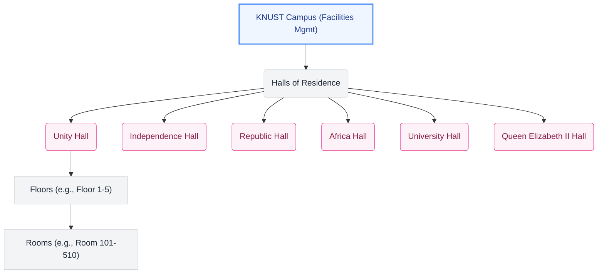

# Crimson Campus | Locations Management & Structure Documentation

This document provides a comprehensive overview of the locations system, data models, interface components, and access control policies within the KNUST Campus Facilities Management dashboard.

---

## 1. Overview & Hierarchy

In the context of the campus facilities dashboard, **Locations** represent the various residential buildings (Halls of Residence) housing students. The maintenance reporting and tracking system resolves issues down to specific rooms inside these halls.

The system uses a four-level location hierarchy:



---

## 2. Data Models & Seeding

The primary locations metadata is defined in [mockData.js](file:///C:/Users/baido/admin-dashboard/src/data/mockData.js).

### Hall Data Structure
Each Hall of Residence is modeled as an object with the following schema:
- `id` (string): Unique identifier.
- `name` (string): The human-readable name of the hall.
- `code` (string): System slug or abbreviated identifier.
- `floors` (number): Total number of floors in the building.
- `rooms` (number): Total capacity/number of rooms.

### Default Seeded Halls
The application initializes with six default halls of residence:

| ID | Hall Name | Code | Floors | Rooms |
|----|-----------|------|--------|-------|
| 1 | Unity Hall | `unity` | 5 | 50 |
| 2 | Independence Hall | `independence` | 4 | 40 |
| 3 | Republic Hall | `republic` | 6 | 60 |
| 4 | Africa Hall | `africa` | 3 | 30 |
| 5 | University Hall | `university` | 4 | 45 |
| 6 | Queen Elizabeth II Hall | `queenshall` | 5 | 55 |

> [!NOTE]
> Maintenance reports stored in [mockData.js](file:///C:/Users/baido/admin-dashboard/src/data/mockData.js#L67-L200) link to these halls using `hallId` and `hallName`, and specify precise room addresses via a formatted string (e.g. `Unity Hall, Floor 2, Room 205`) under the `location` field.

---

## 3. Access Control Policies (RBAC)

Location management is restricted to protect facilities configuration integrity.

- **Super Admin**: Has full CRUD permissions. They can view, add, edit, and delete halls.
- **Hall Admin**: Restricted from managing halls. They can view reports and staff for their assigned hall but do not have access to locations configuration.
- **Technician**: Restricted from managing halls. They only see assigned repair tasks.

### Enforcement Details

1. **Routing Protection**: In [App.js](file:///C:/Users/baido/admin-dashboard/src/App.js#L115-L125), the route `/locations` is protected by `ProtectedRoute` restricting access exclusively to `super_admin`:
   ```javascript
   <Route 
     path="/locations" 
     element={
       <ProtectedRoute allowedRoles={['super_admin']}>
         <Layout user={user} handleLogout={handleLogout}>
           <Locations user={user} />
         </Layout>
       </ProtectedRoute>
     } 
   />
   ```
2. **Navigation Protection**: In [Sidebar.jsx](file:///C:/Users/baido/admin-dashboard/src/components/Sidebar.jsx#L25-L34), the "Locations" navigation item is omitted from the `adminNavItems` and `technicianNavItems` lists, appearing only in `superAdminNavItems`.
3. **Component Protection**: In [Locations.jsx](file:///C:/Users/baido/admin-dashboard/src/pages/Locations.jsx#L18-L21), a fallback redirect is executed if a non-super admin attempts to bypass routes:
   ```javascript
   if (user?.role !== 'super_admin') {
     return <Navigate to="/" />;
   }
   ```

---

## 4. Locations Interface & Form Procedures

The locations interface is implemented in [Locations.jsx](file:///C:/Users/baido/admin-dashboard/src/pages/Locations.jsx).

### Key Functions
- **Add Hall**: Initiated by `handleAddLocation`. Opens a modal window resetting the local form state.
- **Edit Hall**: Initiated by `handleEditLocation`. Populates the form state with the chosen hall's current data.
- **Save Hall**: Executed by `handleSaveLocation`. Validates that `name` and `code` are supplied before inserting a new hall (with a generated `Date.now().toString()` ID) or merging updates into the current list.
- **Delete Hall**: Executed by `handleDeleteLocation`. Prompts the user with a confirmation dialog before filtering out the selected hall from the state.

---

## 5. Architectural Gap & Recommendation

> [!WARNING]
> The current implementation of [Locations.jsx](file:///C:/Users/baido/admin-dashboard/src/pages/Locations.jsx) manages the list of halls strictly in component state (`useState(halls)`). As a result, additions, updates, and deletions will be lost when the page is reloaded.

### Recommended Integration
To ensure persistence, the Locations component should utilize the existing localStorage helpers `getPersistedHalls` and `savePersistedHalls` provided in [mockData.js](file:///C:/Users/baido/admin-dashboard/src/data/mockData.js#L400-L406). 

Below is the diff required to implement persistence:

```diff
-  const [locations, setLocations] = useState(halls);
+  const [locations, setLocations] = useState(() => {
+    const persisted = getPersistedHalls();
+    return persisted.length > 0 ? persisted : halls;
+  });

   const handleSaveLocation = () => {
     if (!isSuperAdmin) return;
     if (!formData.name || !formData.code) {
       alert('Please fill in all required fields');
       return;
     }

+    let updatedLocations;
     if (editingLocation) {
-      setLocations(locations.map(loc =>
-        loc.id === editingLocation.id ? { ...loc, ...formData } : loc
-      ));
+      updatedLocations = locations.map(loc =>
+        loc.id === editingLocation.id ? { ...loc, ...formData } : loc
+      );
     } else {
       const newLocation = { id: Date.now().toString(), ...formData };
-      setLocations([...locations, newLocation]);
+      updatedLocations = [...locations, newLocation];
     }

+    setLocations(updatedLocations);
+    savePersistedHalls(updatedLocations);
     setShowModal(false);
     setFormData({ name: '', code: '', floors: '', rooms: '' });
   };

   const handleDeleteLocation = (id) => {
     if (!isSuperAdmin) return;
     if (window.confirm('Are you sure you want to delete this hall?')) {
-      setLocations(locations.filter(loc => loc.id !== id));
+      const updatedLocations = locations.filter(loc => loc.id !== id);
+      setLocations(updatedLocations);
+      savePersistedHalls(updatedLocations);
     }
   };
```
